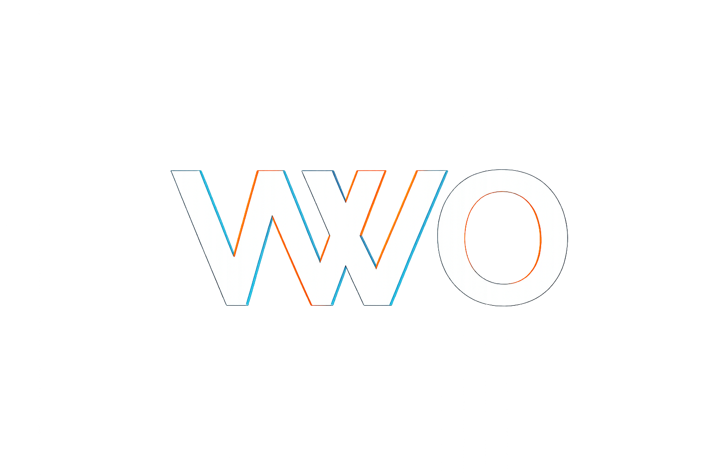
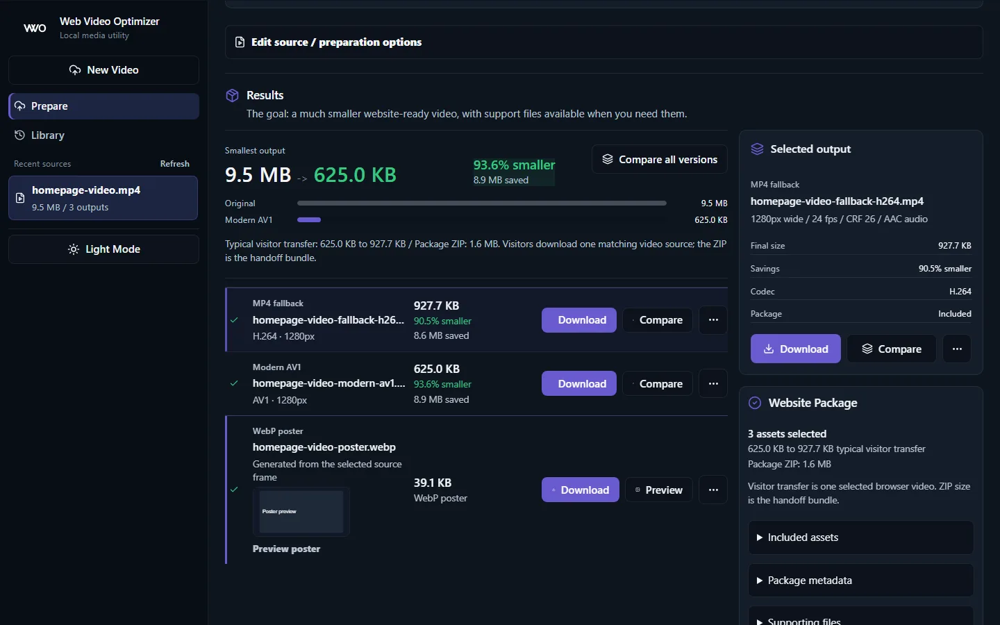
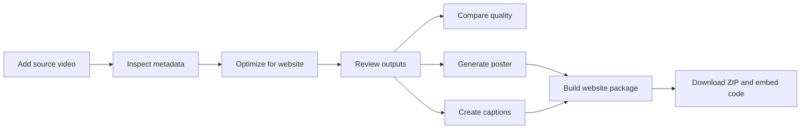
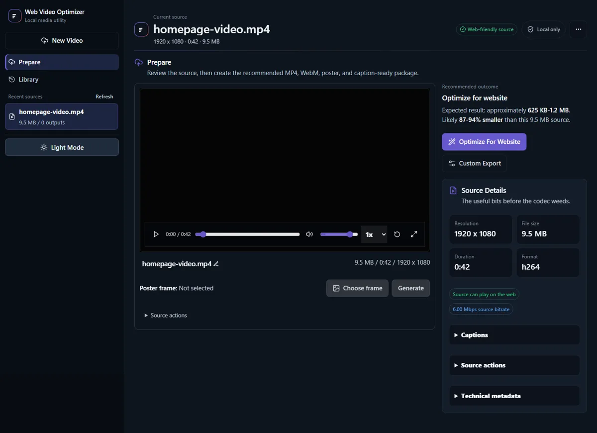
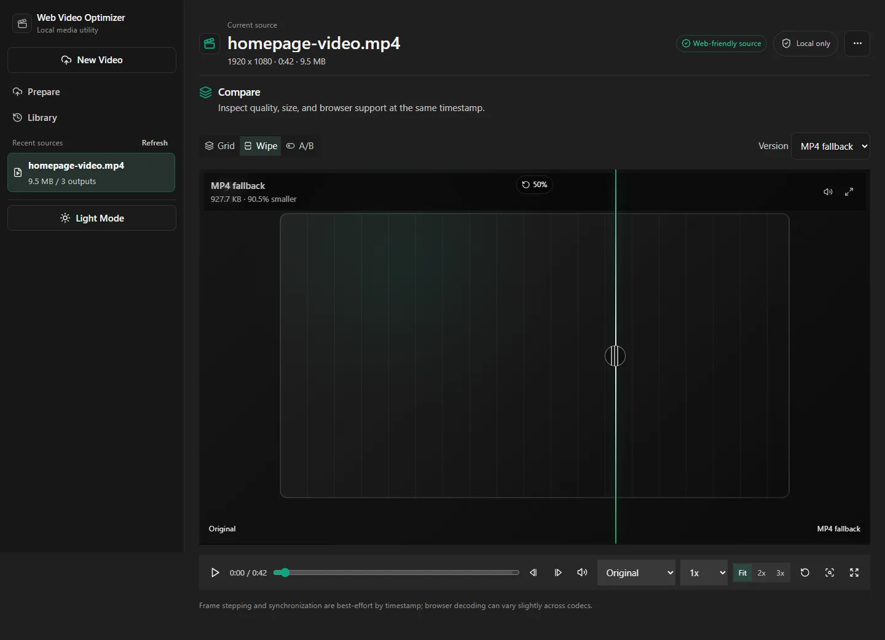
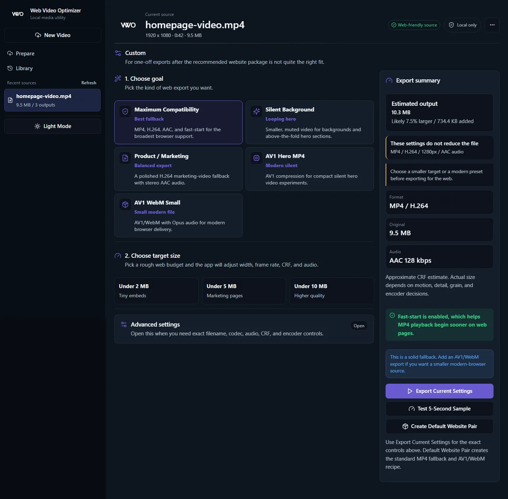
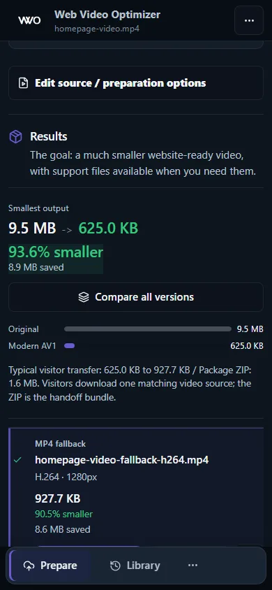

# Web Video Optimizer

<picture>
  <source media="(prefers-color-scheme: light)" srcset="apps/web/public/brand/WVO-logo-transparent.png">
  
</picture>

[](https://github.com/Artsen/web-video-optimizer/actions/workflows/ci.yml)
[](LICENSE)


Web Video Optimizer is a local-first browser app for turning source videos into website-ready assets. It uploads media to your own machine, runs FFmpeg locally, compares output quality in the browser, and builds a clean website package with modern and fallback video files, poster artwork, captions, transcript markup, and SEO-friendly embed code.

<picture>
  <source media="(prefers-color-scheme: light)" srcset="docs/assets/screenshots/results-light.webp">
  
</picture>

## Status

This project is a developer beta. The core local workflow is usable and tested, but the app is intentionally focused on trusted local or LAN use rather than public hosting. There are no accounts, cloud media uploads, analytics, or hosted processing services.

## Why

Preparing video for the web usually means juggling codec settings, fallback files, posters, captions, embed markup, file sizes, and browser preview checks. This app gives that work a single local workspace:

- Import a local file or a supported YouTube URL.
- Inspect metadata before encoding.
- Create a compatible H.264 MP4 and a smaller modern WebM/AV1 output.
- Preview, compare, rename, cancel, delete, and download outputs.
- Generate poster images, captions, transcript markup, and a website ZIP.
- Keep previous sources and jobs available between browser refreshes and API restarts.

## Quick Start

### Local Node

Local development needs Node.js 20 or newer and FFmpeg/FFprobe on PATH.

```powershell
git clone https://github.com/Artsen/web-video-optimizer.git
cd web-video-optimizer
npm ci
npm run dev
```

Open <http://localhost:5173>. The API listens on <http://localhost:4000> and must remain running while the web interface is used.

On Windows PowerShell, use `npm.cmd` if script execution policy blocks `npm.ps1`.

The two-console workflow is still supported:

```powershell
npm run dev:api
```

```powershell
npm run dev:web
```

### Docker Compose

Docker is optional for ordinary local development. When Docker is available:

```powershell
docker compose up --build
```

Open <http://localhost:5173>. The API listens on <http://localhost:4000>, and media is stored in the Docker `video_data` volume. Docker validation for this project is performed by GitHub Actions on Ubuntu.

See [Getting Started](docs/getting-started.md) for FFmpeg setup, LAN access, yt-dlp imports, and optional whisper.cpp captions.

## Workflow



## What It Creates

- `*-fallback-h264.mp4` for broad browser compatibility.
- `*-modern-av1.webm` for modern compression.
- `*-poster.webp` poster artwork.
- `.vtt` and `.srt` caption sidecars when subtitles are generated.
- Optional subtitle-remuxed MP4/WebM outputs.
- A ZIP package with media assets, transcript markup, and `VideoObject` structured data.

## Gallery

| Prepare                                                         | Results                                                         | Compare                                                            |
| --------------------------------------------------------------- | --------------------------------------------------------------- | ------------------------------------------------------------------ |
|  |  |  |

| Custom Export                                                              | Mobile                                                                        |
| -------------------------------------------------------------------------- | ----------------------------------------------------------------------------- |
|  |  |

## Highlights

- Local FFmpeg execution with bounded job scheduling and cancelation.
- Browser comparison theatre with side-by-side, stacked, overlay, and wipe modes.
- Progressive Prepare/Results source workspace with URL restoration.
- History and storage cleanup for sources, outputs, packages, and temporary files.
- Caption generation through optional local whisper.cpp.
- YouTube import through optional local yt-dlp.
- Shared API contracts and video-core helpers with unit, browser, and real-media integration tests.

## Documentation

- [Documentation index](docs/README.md)
- [Getting started](docs/getting-started.md)
- [User guide](docs/user-guide.md)
- [Configuration](docs/configuration.md)
- [API reference](docs/api.md)
- [Architecture](docs/architecture.md)
- [Testing](docs/testing.md)
- [Brand system](docs/brand-system.md)
- [Troubleshooting](docs/troubleshooting.md)

## Privacy And Security

Media processing is local by default. The app stores sources, outputs, temporary files, and the manifest under the configured storage root or Docker volume. Optional yt-dlp imports contact YouTube because they download from the URL you provide; optional whisper.cpp transcription runs locally.

The API has no authentication and is intended for trusted local use. Binding to a LAN address requires `ALLOW_LAN_ACCESS=true`; only do that on a trusted network. See [Privacy](PRIVACY.md) and [Security](SECURITY.md).

## Contributing

Contributions are welcome while the app is in developer beta. Please read [Contributing](CONTRIBUTING.md) before opening a pull request, especially the notes about not committing local media, generated output, coverage, screenshots under `.tmp/`, or environment files.

## License

MIT. See [LICENSE](LICENSE).
