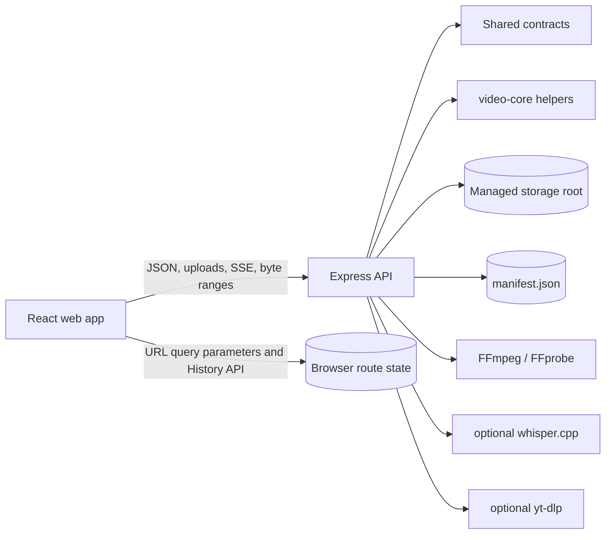
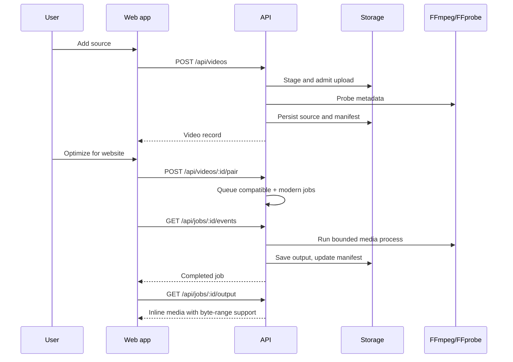
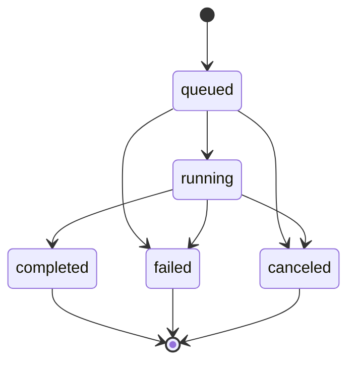
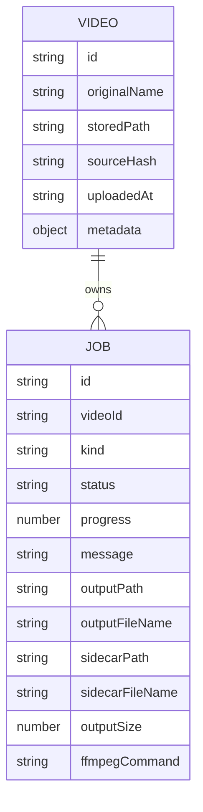

# Architecture

Web Video Optimizer is a local-first web app with a React browser client, an Express API, shared runtime contracts, and FFmpeg-backed media workers. The system is designed around small service boundaries so video processing, storage cleanup, package generation, captions, and UI routing can evolve without changing the public API casually.

## System Context

The API is intentionally local and unauthenticated. CORS defaults only allow the local development origins. LAN binding is available through explicit configuration and should be treated as trusted-network-only operation.

## Processing Flow

## Workspace Layout

- `apps/api` contains the Express server, runtime composition, route validation, storage boundary, repositories, schedulers, and media services.
- `apps/web` contains the React app, route state, feature views, browser API client, Playwright tests, and UI styles.
- `packages/contracts` contains shared DTO and encoding schemas used by both API and web.
- `packages/video-core` contains pure filename, encoding, metadata, and progress helpers.
- `docs` contains user, developer, architecture, testing, and troubleshooting documentation.
- `data` is local runtime media storage and must remain untracked.
- `.tmp` is local review/test scratch space and must remain untracked.

## Public Contracts

The API accepts and returns DTOs from `packages/contracts` rather than exposing internal entities. Request validation is strict: unknown keys are rejected, IDs are sanitized, JSON bodies are size-limited, and filenames cannot contain path separators or ASCII control characters.

The `video-core` package holds pure logic that is useful on either side of the boundary, including FFmpeg argument construction, filename sanitization, metadata derivation, and progress parsing. This keeps behavior testable without starting the server.

## API Composition

`createProductionRuntime` wires the production dependencies once:

- repositories for videos and jobs
- manifest persistence
- media probing
- FFmpeg capability checks
- optional whisper.cpp and yt-dlp adapters
- job lifecycle and scheduling services
- process registry and process runner
- storage boundary, reservations, capacity checks, and housekeeping
- cleanup, package, caption, video, and job services

Routes depend on the runtime interface rather than constructing services directly. This keeps tests fast and lets integration tests run against the compiled API without changing route code.

## Job Lifecycle

The scheduler enforces `MAX_CONCURRENT_MEDIA_JOBS`. Queued cancelation prevents execution, running cancelation terminates the active process, and shutdown cancelation cleans partial artifacts before persistence. Job snapshots are copied so callers cannot mutate scheduler internals.

## Storage Model

Managed storage lives under `STORAGE_ROOT`:

- `uploads` stores admitted source videos.
- `outputs` stores completed job artifacts and packages.
- `tmp` stores temporary work files and upload staging.
- `manifest.json` stores durable history.

The storage boundary resolves files by managed area, blocks traversal, and opens files through descriptors. Cleanup removes canceled jobs, deleted videos, orphan files, stale temporary files, and partial failed outputs. Capacity checks can reserve bytes before paired website jobs so one output is not admitted unless the pair can be scheduled safely.

## Persistence And Recovery

The manifest store writes through a temporary file and keeps a backup of the last valid manifest. On API startup, the runtime loads history, restores completed jobs with existing outputs, marks interrupted queued/running jobs appropriately, skips dangling jobs, merges duplicate videos, prunes orphan files, and saves a fresh manifest.

## Media Capabilities

FFprobe extracts metadata and subtitle-track status. FFmpeg handles optimization, posters, packages, remuxed subtitles, and byte-range-friendly preview outputs. Optional whisper.cpp can generate captions locally when configured. Optional yt-dlp can import videos from validated YouTube URLs.

## Frontend Model

Entity fields such as `storedPath`, `sourceHash`, `outputPath`, `sidecarPath`, and raw manifest content are API-private and are not returned through public DTOs. Public video and job DTOs expose safe IDs, display filenames, metadata, job state, output sizes, and command previews needed by the browser.

The web app has a small bootstrap in `main.tsx`, a production app factory, route helpers, feature-local hooks, and focused views for Prepare, Results, Compare, Library, custom export settings, captions, posters, and packages.

Prepare and Results are progressive states of the same source workspace:

- new or unprocessed sources open in Prepare
- processed historical sources default to Results
- explicit Prepare URLs stay in Prepare
- refresh and browser navigation restore selected source and view

Compare stores selected output, mode, layout, and visible versions in the URL. Volatile playback state such as time, volume, zoom, pan, wipe position, and fullscreen is not persisted.

## Testing Boundaries

Fast tests cover pure packages, API services, route validation, storage policy, scheduler behavior, frontend derivations, and representative UI components. Playwright tests cover browser workflows, accessibility scans, console gating, and a tiny real-stack encode path. The compiled API integration suite uses real FFmpeg/FFprobe for upload, encoding, range streaming, poster generation, packages, cleanup, timeout, cancelation, and recovery behavior.

See [Testing](testing.md) for command details.

## Extension Points

Near-term extension work should stay within the existing boundaries:

- shared runtime contracts for any new request/response shape
- more video-core extraction for reusable media behavior
- clearer API service composition where workflows continue growing
- real FFmpeg integration tests for any new media path
- CLI or MCP wrappers only after the local API remains stable
